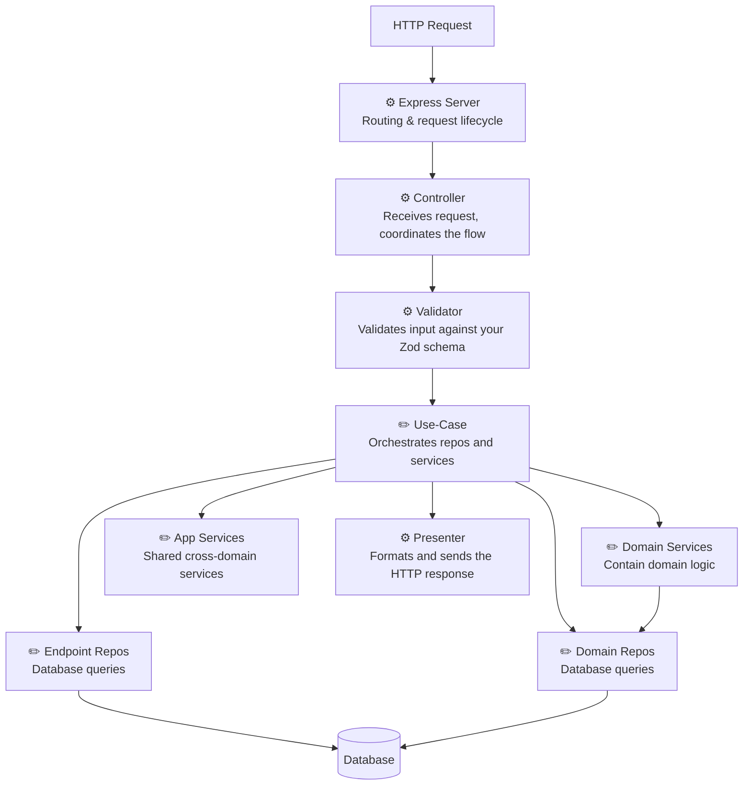
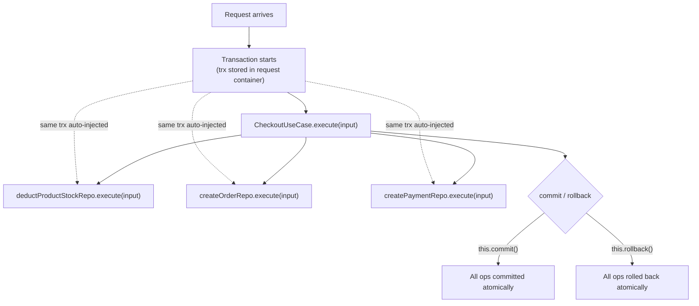

# Devux

**Devux** is an opinionated full-stack TypeScript framework for Node.js, designed for building highly testable, maintainable, enterprise-grade applications with type-safe RESTful APIs. It enforces clean architecture, provides end-to-end type safety, speeds up development, and improves developer experience.

> [Documentation](https://devuxjs.com) &nbsp;·&nbsp; [Getting Started →](https://devuxjs.com/docs/getting-started)

<br>


**Created by Inas Sirhan**<br>
[LinkedIn](https://linkedin.com/in/inas-sirhan) &nbsp;·&nbsp; [inassirhan@gmail.com](mailto:inassirhan@gmail.com)

<br clear="left" />

---

## Key Features

- **End-to-end type safety** – A single source of truth for types across the stack, eliminating drift and type mismatches
- **Clean architecture** – Business logic remains pure and decoupled from HTTP, database, and other infrastructure concerns. Each layer is independently testable
- **CLI code generation** – Boilerplate, naming, wiring, and structure are generated automatically. Focus on business logic, not setup
- **Automatic validation** – Inputs and outputs are validated across managed layers (database I/O, API responses) during development, catching bugs TypeScript can't
- **Dependency injection** – Declare and manage dependencies via the CLI. The framework handles all wiring and resolution
- **Type-safe testing** – Ready-to-use test files and tester classes are generated per endpoint and layer. Zero setup, automatically wired, fully type-safe mocking
- **Managed HTTP layer** – Server and routes are set up by the framework. Request payload is parsed, validated, and passed to your use-case. The output is automatically sent as a response
- **Transaction management** – Transactions are scoped to the use-case. Serialization and deadlock errors trigger automatic retries with exponential backoff. Isolation level, access mode, and max retries are configurable per endpoint
- **Type-safe database queries** – Kysely query builder with automatic snake_case ↔ camelCase conversion. Define your Drizzle schema, generate TypeScript types, write queries with full type inference
- **Auto-generated OpenAPI spec** – API docs generated from your request/response schemas, viewable in the browser
- **Auto-generated API clients** – Type-safe React Query + Axios frontend client and fetch-based E2E client, generated from the OpenAPI spec
- **Dependency visualization** – Interactive graph of all endpoints and their dependencies, filterable by domain, method, and more
- **Monorepo structure** – Share types, schemas, and utilities between frontend and backend with zero duplication
- **i18n support** – Generate translation files from error codes used in API responses

---

## Problems it Solves

| Problem | How Devux Solves It |
|---|---|
| Type drift between frontend and backend | Shared Zod schemas — single source of truth for request/response types |
| Unhandled error cases | Result pattern with exhaustive checking — compiler forces you to handle all cases |
| SQL injection | Type-safe Kysely query builder — no raw SQL |
| Forgetting validation | Automatic input/output validation layer — impossible to skip |
| Transaction leaks | Framework manages commit/rollback — no forgotten open transactions |
| Tight coupling | Enforced DI — fully swappable, mockable dependencies |
| Inconsistent structure | Enforced clean architecture patterns across the entire codebase |
| Boilerplate fatigue | CLI generates all repetitive code and wiring — no more copy-paste |
| API client drift | Client auto-generated from the live OpenAPI spec — always in sync |
| Circular dependencies | CLI tracks the full dependency graph and prevents cycles at creation time |

---

## Tech Stack

| Layer | Technology |
|---|---|
| Backend | Node.js, Express 5, TypeScript |
| Frontend | React 19, TypeScript, Vite |
| Database | PostgreSQL, Drizzle ORM (schema + migrations), Kysely (queries) |
| DI Container | InversifyJS |
| Validation | Zod |
| API Client | Orval (OpenAPI → React Query + Axios) |
| Monorepo | pnpm workspaces, Turborepo |
| Testing | Vitest |

> **Note:** The template ships with React 19, but the frontend is entirely optional. You can swap it for any framework — Vue, Svelte, Next.js, a mobile app, or no frontend at all. All the core benefits (type-safe API client, shared Zod schemas, shared types, OpenAPI spec) work independently of the frontend choice.

---

## Architecture

Every endpoint follows the same layered structure. The Express server, routing, payload parsing, validation, and response handling are fully managed — you only write business logic:



> **⚙️ fully managed** — auto-generated and fully abstracted by the framework, you never touch them.
>
> **✏️ you complete** — auto-generated with the full structure, imports, and DI wiring already in place, you just fill in the logic.

### Dependency Rules

Not everything can depend on everything. The framework enforces these rules:

| Component | Can Depend On |
|---|---|
| Use-Case | Domain repos, domain services, app services |
| Domain Service | Domain repos, other domain services, app services |
| Endpoint Repo | App services only |
| Domain Repo | App services only |
| App Service | Other app services (with scope rules) |

Repos are intentionally restricted — they should only do database operations, not contain business logic.

### Dependency Injection & Containers

Devux uses [InversifyJS](https://inversify.io/) with two types of containers that work together on every request.

The **App Container** is created once at startup and holds global-scoped app services — singletons shared across all requests (e.g. an email service, an S3 client).

The **Request Container** is created fresh for every incoming request and inherits from the App Container. It holds all endpoint components (Use-Case, Repos, Presenter, Validator, Controller), request-scoped app services, and the request context (session, userId, transaction connection, etc.). It is destroyed once the request lifecycle ends.

App services can be either **global** or **request-scoped** — you choose the scope when creating one via the CLI. Request-scoped services have access to the current request context; global ones do not.

You never interact with any of this directly — the CLI manages all bindings, tokens, and wiring automatically. Everything in `__internals__/` is generated and kept in sync as you add or remove components and dependencies.

---

### No Prop Drilling

In traditional architectures, context travels as function arguments through every layer:

```typescript
// Traditional — trx, userId, requestId passed at every level
async function checkout(userId: string, input: CheckoutInput, trx: Transaction) {
    await stockRepo.deductStock(input.productId, input.quantity, trx);
    await orderRepo.createOrder(userId, input, trx);
    await paymentService.charge(userId, input.amount, trx);
}
```

In Devux, the request container holds the transaction connection and request context. Every injectable just declares what it needs — the framework injects it:

```typescript
// Devux — no passing, no drilling
@fullInjectable()
class CheckoutUseCase extends TransactionalUseCase<CheckoutRequest> {
    // each repo automatically receives the same trx — no passing required
    @injectDeductProductStockRepo()  private readonly deductProductStockRepo!: IDeductProductStockRepo;
    @injectCreateOrderRepo()         private readonly createOrderRepo!: ICreateOrderRepo;
    @injectCreatePaymentRepo()       private readonly createPaymentRepo!: ICreatePaymentRepo;

    protected async _execute(input: CheckoutRequest): Promise<void> {
        await this.deductProductStockRepo.execute(input);
        await this.createOrderRepo.execute(input);
        await this.createPaymentRepo.execute(input);
        await this.commit(); // commits all three — same connection, same transaction
    }
}
```

The same applies to request context — session data, the current user, a request ID — any request-scoped injectable can access it directly without it being passed down:

```typescript
@fullInjectable()
class CreateOrderRepo extends TransactionalRepo<...> {
    @injectSessionContext()  private readonly sessionContext!: ISessionContext;

    async _execute(input: ...) {
        await this.trx
            .insertInto('orders')
            .values({ ...input, createdBy: this.sessionContext.userId })
            .execute();
    }
}
```

---

### Transaction Management

Every `TransactionalUseCase` gets its own database transaction — started automatically when `_execute` is called, and committed or rolled back based on what you return.

The transaction connection (`trx`) is stored in the **request container** for the duration of that request. Every transactional repo — whether injected directly into the use-case or into a domain service — receives the same `trx` via DI, not as a function argument. This means all DB operations across all repos in a single use-case run atomically in one transaction, with zero manual wiring.



**Automatic retry on transient errors:**

If the database returns a deadlock or serialization error, the framework catches it, rolls back, waits (exponential backoff + jitter), and retries the entire use-case — starting a fresh transaction. This is fully transparent: your `_execute` method simply runs again. No retry logic in your code.

```typescript
@fullInjectable()
class CheckoutUseCase extends TransactionalUseCase<CheckoutRequest> {
    @injectCheckoutPresenter()       private readonly presenter!: ICheckoutPresenter;
    @injectDeductProductStockRepo()  private readonly deductProductStockRepo!: IDeductProductStockRepo;
    @injectCreateOrderRepo()         private readonly createOrderRepo!: ICreateOrderRepo;
    @injectCreatePaymentRepo()       private readonly createPaymentRepo!: ICreatePaymentRepo;

    // Required — define the transaction isolation level and access mode
    protected getIsolationLevel(): TransactionIsolationLevel {
        return 'serializable';
    }

    protected getAccessMode(): TransactionAccessMode {
        return 'read write';
    }

    // Optional overrides — defaults come from coreConfig
    protected override getTransactionMaxAttempts(): number {
        return 5;
    }

    protected override getDurationThresholdMillis(): number {
        return 500; // warn if this use-case takes longer than 500ms
    }

    protected async _execute(input: CheckoutRequest): Promise<void> {
        // trx is automatically injected into every repo — no argument passing needed
        const stockResult = await this.deductProductStockRepo.execute(input);
        if (stockResult.success === false) {
            await this.rollback();
            return this.presenter.present('InsufficientStock');
        }

        await this.createOrderRepo.execute(input);
        await this.createPaymentRepo.execute(input);
        await this.commit();
        return this.presenter.present('CheckoutCompleted');
    }
}
```

**Isolation levels** — see [PostgreSQL docs](https://www.postgresql.org/docs/current/transaction-iso.html):

| Level |
|---|
| `read-committed` |
| `repeatable-read` |
| `serializable` |

**Non-transactional use-cases** use `this.db` (a connection pool) instead of `this.trx`. There is no transaction, no `commit`, no `rollback`, and no retry — each repo call gets its own connection from the pool independently.

---

### No DTO Hell

Traditional layered architectures often require a separate DTO (data transfer object) at every boundary — controller DTO, service DTO, repo DTO, DB entity — with manual mapping between each.

In Devux, the **Zod schema** is the single source of truth for request shape. Kysely infers types directly from the DB schema. The **Result pattern** carries typed data between layers without intermediate objects. There are no mapping classes, no assembly layers, and no redundant type definitions:

```typescript
// The Zod schema defines the request shape — used by the validator, the controller,
// the generated API client, and the OpenAPI spec. Defined once, used everywhere.

// Kysely infers return types directly from the DB schema — no manual entity classes.
const result = await this.trx
    .selectFrom('orders')
    .select(['id', 'total', 'createdAt'])
    .where('userId', '=', input.userId)
    .executeTakeFirst();
// result is fully typed — no mapping needed

// The Result pattern carries data up through layers without wrapper objects:
return { success: true, data: result };
```

---

### Runtime Validation

TypeScript gives you compile-time safety, but it can't protect you at the boundaries where the type system has no visibility:

- **HTTP request bodies** — TypeScript trusts `req.body` is what you declared, but at runtime it's `unknown`
- **Database query results** — Kysely types are derived from your schema, but the actual DB data may differ (a migration was missed, a column was renamed, an external tool wrote unexpected data)
- **API responses** — the TypeScript return type says one thing, but the actual object returned may be missing fields or have the wrong shape

Devux validates at all of these boundaries automatically:

- **Request input** — the Zod schema is validated by the framework before your use-case receives anything. If validation fails, the request is rejected and `onValidationError` is called — your use-case never runs with bad input
- **Repo output** — each repo declares a `dataSchema` for what it expects to receive from the DB. In development, the framework validates every query result against it and throws if the shape doesn't match — catching schema drift before it reaches production
- **API responses** — each response variant has a Zod schema. In development, the presenter validates every response before it's sent — catching missing fields or wrong types before they reach the frontend

```typescript
// Repo output validation — catches DB schema drift in development
protected getSchema() {
    return {
        dataSchema: zodStrictPick(ordersBaseZodSchema, {
            id: true,
            total: true,
            status: true,
        }),
    };
}
```

This catches an entire class of bugs that TypeScript alone can never prevent — data that's wrong at the boundary, not in the business logic.

---

### Result Pattern — No Thrown Exceptions

Repos and domain services never throw exceptions for expected failure cases. They return a **discriminated union**:

```typescript
type Result<T, E extends string> =
    | { success: true; data: T }
    | { success: false; errorCode: E }
```

**Why this matters over throwing:**

- **Exhaustive handling** — the compiler forces you to handle every error code. Add a new error code to a repo and every use-case that calls it gets a compile error until you handle it
- **No hidden control flow** — exceptions can bubble up silently through any number of layers. Results are explicit — you see every failure path in the code
- **Type-safe error codes** — error codes are string literal union types, not magic strings. Typos are compile errors
- **`assertNeverReached`** — if you handle all known error codes and call this, the compiler verifies you haven't missed one. If the repo adds a new code later, this line breaks at compile time

```typescript
const result = await this.getProductStockRepo.execute({ productId: input.productId });

if (result.success === false) {
    if (result.errorCode === OrdersErrorCodes['ProductNotFound']) {
        await this.rollback();
        return this.presenter.present('ProductNotFound');
    }
    assertNeverReached(result.errorCode); // compile error if any case is unhandled, throws at runtime too
}

// result.data is now fully typed — TypeScript knows success === true
if (result.data.quantity < input.quantity) {
    await this.rollback();
    return this.presenter.present('InsufficientStock');
}
```

The same pattern applies to domain services — any operation that can fail in an expected way returns a Result instead of throwing.

**Where the Result pattern applies:** repos and domain services. Use-cases consume their results and route to the presenter accordingly.

**What still throws:** unexpected errors (bugs, DB connectivity issues, etc.) and global errors (auth/authz, CSRF, rate limiting, file upload violations) throw typed `ApiError` exceptions caught by the global error handler. The Result pattern is only for expected, domain-level failures.

---

## Project Structure

```
apps/
  backend/src/
    domains/
      customers/                             ← A domain groups related functionality
        endpoints/
          create-customer/                   ← One folder per endpoint
            repos/
            │   └── create-customer/
            │       ├── create-customer.repo.ts              ★ you complete
            │       ├── create-customer.repo.zod.schemas.ts  ★ you complete
            │       └── tests/
            │           └── create-customer.repo.test.ts     ★ you complete
            tests/
            │   ├── create-customer.use-case.test.ts         ★ you complete
            │   └── create-customer.e2e.test.ts              ★ you complete
            create-customer.use-case.ts      ★ you complete (business logic)
            create-customer.responses.ts     ★ you complete (response definitions)
            create-customer.route.config.ts  ★ you complete (route + HTTP config)
        repos/                               ← Domain repos (shared across endpoints)
        services/                            ← Domain services (shared business logic)

    app-services/                            ← Cross-domain services

    infrastructure/
      core/
        database/                            ← Transaction manager, connection pool
        core-hooks.ts                        ← Hook implementations (logging, monitoring)
        core.config.ts                       ← Framework configuration
      database/
        drizzle/tables/                      ← Drizzle table definitions + constraint names
        kysely/
          kysely.database.generated.types.ts ← Auto-generated from DB (gen-db-table)
          kysely.database.fixed.types.ts     ← Manual type overrides if needed
          plugins/
            case-transformer.kysely.plugin.ts ← snake_case ↔ camelCase auto-conversion

    __internals__/                           ✦ fully auto-generated — never touch this
      domains/
        customers/
          endpoints/
            create-customer/
              create-customer.tester.ts      ← Generated tester class
              create-customer.controller.ts
              create-customer.presenter.ts
              create-customer.inversify.bindings.ts
              create-customer.inversify.tokens.ts
              ...
      app-services/
      registries/
        injectables-registry.json            ← Tracks all components + their dependencies
        domains-registry.json
        endpoints-ids-registry.json

  frontend/src/                              ← React 19 app (replaceable with any framework)

packages/
  shared/src/
    shared-app/
      domains/
        customers/
          customers.error-codes.ts           ← Typed error codes (shared frontend/backend)
          customers.constants.ts
          zod-schemas/
            customers.base.zod.schema.ts     ← Base schema (shared frontend/backend)
            create-customer/
              create-customer.zod.schema.ts  ← Request schema (shared frontend/backend)
    api/
      api.react-query.ts                     ✦ auto-generated — React Query + Axios client

  backend/api/
    openapi.json                             ✦ auto-generated — OpenAPI spec
    api.fetch.ts                             ✦ auto-generated — fetch client (E2E tests)
```

---

## Getting Started

### Prerequisites

- Node.js >= 18
- pnpm >= 9
- PostgreSQL

### Setup

```bash
git clone https://github.com/inas-sirhan/devuxjs.git my-app
cd my-app
pnpm install

# Configure environment
cp apps/backend/.env.example apps/backend/.env
# Edit .env with your database credentials

# Start dev server
pnpm dev
```

---

## CLI

The CLI is your main tool. It generates and wires everything so you can focus purely on writing business logic.

```bash
pnpm devux
```

```
What do you want to work with?
  Domains          – Create / delete domain folders
  Endpoints        – Create / delete endpoints, manage dependencies
  Domain Repos     – Shared repos within a domain
  Domain Services  – Shared business logic within a domain
  App Services     – Cross-domain services (global or request-scoped)
  Base Classes     – Add a dependency to all components of a type at once
  List & Inspect   – View all injectables and their dependencies
  Visualize        – Open dependency graph in browser
```

All selectors support autocomplete search. Select `← Back` at any submenu to go back.

All names must be in **kebab-case** — the CLI automatically converts to PascalCase for class names, camelCase for variables, and so on. When you add or remove dependencies, the CLI also automatically regenerates the affected tester classes to keep them in sync.

### Example: Creating an Endpoint

```
pnpm devux → Endpoints → Create

  Domain:               customers
  Endpoint ID:          create-customer
  Route:                /customers
  HTTP Method:          POST
  Transactional:        yes
  Generate default repo: yes
```

This generates the **full endpoint** — use-case, controller, validator, presenter, Zod schema, route config, repo, test files, and tester class — all wired up and ready. No manual imports, no DI configuration.

---

## Real Examples

### 1. Endpoint Schema (shared between frontend & backend)

```typescript
// packages/shared/.../orders/zod-schemas/checkout/checkout.zod.schema.ts

export const checkoutZodSchema = zodStrictPick(ordersBaseZodSchema, {
    productId: true,
    quantity: true,
});

export type CheckoutRequest = z.infer<typeof checkoutZodSchema>;
```

This schema drives everything: request validation, TypeScript types, OpenAPI spec, and the auto-generated frontend API client.

---

### 2. Transactional Use-Case — Checkout (multi-repo, atomic)

When a user checks out, three things must happen atomically — check stock, deduct stock, create order. If any step fails, everything rolls back. This is exactly what `TransactionalUseCase` is for.

```typescript
// domains/orders/endpoints/checkout/checkout.use-case.ts

@fullInjectable()
export class CheckoutUseCase extends TransactionalUseCase<CheckoutRequest> {
    @injectCheckoutPresenter()       private readonly presenter!: ICheckoutPresenter;
    @injectGetProductStockRepo()     private readonly getProductStockRepo!: IGetProductStockRepo;
    @injectDeductProductStockRepo()  private readonly deductProductStockRepo!: IDeductProductStockRepo;
    @injectCreateOrderRepo()         private readonly createOrderRepo!: ICreateOrderRepo;

    protected override getIsolationLevel(): TransactionIsolationLevel {
        return 'repeatable-read'; // stock reads must stay consistent under concurrent requests
    }

    protected override getAccessMode(): TransactionAccessMode {
        return 'read-write';
    }

    protected override async _assertCanAccess(): Promise<void> {
        await this.accessGuard.assertIsLoggedIn();
    }

    protected override async _execute(input: CheckoutRequest): Promise<void> {
        // 1. Check stock
        const stockResult = await this.getProductStockRepo.execute({ productId: input.productId });
        if (stockResult.success === false) {
            if (stockResult.errorCode === OrdersErrorCodes['ProductNotFound']) {
                await this.rollback();
                return this.presenter.present('ProductNotFound');
            }
            assertNeverReached(stockResult.errorCode);
        }

        if (stockResult.data.quantity < input.quantity) {
            await this.rollback();
            return this.presenter.present('InsufficientStock');
        }

        // 2. Deduct stock
        await this.deductProductStockRepo.execute({ productId: input.productId, quantity: input.quantity });

        // 3. Create order — all three repos share this.trx, fully atomic
        const orderResult = await this.createOrderRepo.execute({
            userId: this.userContext.userId,
            productId: input.productId,
            quantity: input.quantity,
        });
        if (orderResult.success === false) {
            assertNeverReached(orderResult.errorCode);
        }

        await this.commit();
        return this.presenter.present('OrderPlaced', orderResult.data);
    }
}
```

**Automatic retry:** deadlocks and serialization errors are retried automatically with exponential backoff + jitter. Override per use-case if needed:

```typescript
protected override getTransactionMaxAttempts(): number {
    return 5; // default comes from core config
}

protected override getTransactionBaseDelayMillis(): number {
    return 50;
}
```

`getDurationThresholdMillis` is available on all use-cases (transactional and non-transactional) — override it if this use-case legitimately takes longer than the default threshold:

```typescript
protected override getDurationThresholdMillis(): number {
    return 500;
}
```

---

---

### 3. Non-Transactional Use-Case — Logout (minimal)

The simplest possible use-case — no DB needed, just destroy the session. Great example of how clean and minimal a non-transactional use-case can be.

```typescript
// domains/auth/endpoints/logout/logout.use-case.ts

@fullInjectable()
export class LogoutUseCase extends NonTransactionalUseCase<LogoutRequest> {
    @injectLogoutPresenter()  private readonly presenter!: ILogoutPresenter;
    @injectSessionManager()   private readonly sessionManager!: ISessionManager;

    protected override async _assertCanAccess(): Promise<void> {
        // public endpoint
    }

    protected override async _execute(_input: LogoutRequest): Promise<void> {
        await this.sessionManager.destroy();
        return this.presenter.present('LoggedOut');
    }
}
```

```typescript
// logout.responses.ts
export const logoutResponses = {
    'LoggedOut': createSuccess204NoContentApiResponse(),
} as const satisfies Responses;
```

---

### 3. Non-Transactional Use-Case — Signup (multi-service)

A non-transactional use-case orchestrating multiple services — guards against already-logged-in state, hashes the password, creates the user (with constraint handling), and sends a welcome email.

```typescript
// domains/auth/endpoints/signup/signup.use-case.ts

@fullInjectable()
export class SignupUseCase extends NonTransactionalUseCase<SignupRequest> {
    @injectSignupPresenter()  private readonly presenter!: ISignupPresenter;
    @injectSignupRepo()       private readonly signupRepo!: ISignupRepo;
    @injectSessionContext()   private readonly sessionContext!: ISessionContext;
    @injectPasswordService()  private readonly passwordService!: IPasswordService;
    @injectEmailService()     private readonly emailService!: IEmailService;

    protected override async _assertCanAccess(): Promise<void> {
        // public endpoint
    }

    protected override async _execute(input: SignupRequest): Promise<void> {
        if (this.sessionContext.isLoggedIn()) {
            return this.presenter.present('AlreadyLoggedIn');
        }

        const hashedPassword = await this.passwordService.hash(input.password);

        const result = await this.signupRepo.execute({ ...input, hashedPassword });

        if (result.success === false) {
            if (result.errorCode === AuthErrorCodes['EmailAlreadyRegistered']) {
                return this.presenter.present('EmailAlreadyRegistered');
            }
            assertNeverReached(result.errorCode);
        }

        this.emailService.sendWelcomeEmail({ to: input.email, name: input.firstName });

        return this.presenter.present('SignedUpSuccessfully');
    }
}
```

---

---

### 4. Responses — Checkout

Each response maps to a business outcome. Error responses point to the field that caused the error via the `path` field (type-safe — must be a valid dotted path of the request type).

```typescript
// domains/orders/endpoints/checkout/checkout.responses.ts

export const checkoutResponses = {
    'ProductNotFound': createErrorApiResponse({
        statusCode: 404,
        errorCode: OrdersErrorCodes['ProductNotFound'],
        path: 'productId' satisfies DottedPath<CheckoutRequest>,
    }),
    'InsufficientStock': createErrorApiResponse({
        statusCode: 409,
        errorCode: OrdersErrorCodes['InsufficientStock'],
        path: 'quantity' satisfies DottedPath<CheckoutRequest>,
    }),
    'OrderPlaced': createSuccessApiResponse({
        statusCode: 201,
        dataSchema: zodStrictPick(ordersBaseZodSchema, {
            orderId: true,
            totalPrice: true,
        }),
    }),
} as const satisfies Responses;
```

All responses are automatically included in the OpenAPI spec and typed in the generated API client.

---

---

### 5. Repos — Transactional & Non-Transactional

Repos use [Kysely](https://kysely.dev/) — a type-safe SQL query builder. The case converter plugin handles `snake_case` ↔ `camelCase` automatically — you always work in camelCase, zero manual mapping.

- **Transactional repos** use `this.trx` — the shared transaction connection, automatically provided by the framework
- **Non-transactional repos** use `this.db` — the connection pool, each query runs independently

#### Transactional Repo — deduct stock

```typescript
// domains/orders/endpoints/checkout/repos/deduct-product-stock/deduct-product-stock.repo.ts

@fullInjectable()
export class DeductProductStockRepo
    extends TransactionalRepo<DeductProductStockRepoInput, DeductProductStockRepoOutput>
    implements IDeductProductStockRepo {

    protected override async _execute(input: DeductProductStockRepoInput): Promise<DeductProductStockRepoOutput> {
        await this.trx  // ← shared transaction connection
            .updateTable('products')
            .set(eb => ({ quantity: eb('quantity', '-', input.quantity) }))
            .where('productId', '=', input.productId)
            .execute();

        return { success: true };
    }
}
```

#### Non-Transactional Repo — signup with constraint handling

Constraint violations are mapped to typed error codes automatically — no try/catch needed:

```typescript
// domains/auth/endpoints/signup/repos/signup/signup.repo.ts

@fullInjectable()
export class SignupRepo
    extends NonTransactionalRepo<SignupRepoInput, SignupRepoOutput>
    implements ISignupRepo {

    protected override getUniqueKeyViolationErrorMap() {
        return {
            [UsersConstraintsNames.Uniques.Email]: AuthErrorCodes['EmailAlreadyRegistered'],
        } as const;
    }

    protected override async _execute(input: SignupRepoInput): Promise<SignupRepoOutput> {
        await this.db  // ← connection pool, no transaction
            .insertInto('users')
            .values({ ...input, role: UsersRoles.Student, isApproved: false })
            .execute();

        return { success: true };
    }
}
```

Foreign key violations are handled the same way. Use `getForeignKeyViolationErrorMap` to map each constraint to a typed error code:

```typescript
@fullInjectable()
export class CreateOrderRepo
    extends TransactionalRepo<CreateOrderRepoInput, CreateOrderRepoOutput>
    implements ICreateOrderRepo {

    protected override getForeignKeyViolationErrorMap() {
        return {
            // INSERT fails if the referenced user doesn't exist
            [OrdersConstraintsNames.Foreigns.UserId]:    UsersErrorCodes['UserNotFound'],
            // INSERT fails if the referenced product doesn't exist
            [OrdersConstraintsNames.Foreigns.ProductId]: ProductsErrorCodes['ProductNotFound'],
        } as const;
    }

    protected override async _execute(input: CreateOrderRepoInput): Promise<CreateOrderRepoOutput> {
        await this.trx.insertInto('orders').values(input).execute();
        return { success: true };
    }
}
```

Use `getDefaultForeignKeyViolationError` as a catch-all fallback for any FK violation not matched in the map — or when you don't need to distinguish between constraints at all:

```typescript
@fullInjectable()
export class CreatePaymentRepo
    extends TransactionalRepo<CreatePaymentRepoInput, CreatePaymentRepoOutput>
    implements ICreatePaymentRepo {

    // Any FK violation falls back to this error
    protected override getDefaultForeignKeyViolationError() {
        return UsersErrorCodes['UserNotFound'];
    }

    protected override async _execute(input: CreatePaymentRepoInput): Promise<CreatePaymentRepoOutput> {
        await this.trx.insertInto('payments').values(input).execute();
        return { success: true };
    }
}
```

Constraint names are kept in a constants file — no magic strings:

```typescript
// infrastructure/database/drizzle/tables/users/users.drizzle.constraints-names.ts
export const UsersConstraintsNames = {
    Uniques: {
        Email: 'users_email_unique',
    },
    Foreigns: {
        UserId: 'orders_user_id_fk',
    },
} as const;
```

#### Common Kysely Queries

```typescript
// Select one
const product = await this.trx
    .selectFrom('products')
    .where('productId', '=', input.productId)
    .select(['productId', 'name', 'quantity'])
    .executeTakeFirst();

// Insert with returning
const order = await this.trx
    .insertInto('orders')
    .values(input)
    .returningAll()
    .executeTakeFirstOrThrow();

// Update
await this.trx
    .updateTable('products')
    .set({ quantity: input.quantity })
    .where('productId', '=', input.productId)
    .execute();

// Delete with returning
const deleted = await this.trx
    .deleteFrom('orders')
    .where('orderId', '=', input.orderId)
    .returning(['userId', 'totalPrice'])
    .executeTakeFirst();
```

---

---

### 6. Database Schema (Drizzle)

Devux uses a `createDrizzleTable` utility that wraps Drizzle's `pgTable` with a `col` helper — columns are defined in camelCase and automatically mapped to `snake_case` in the database.

```typescript
// infrastructure/database/drizzle/tables/users/users.drizzle.table.ts

export const usersTable = createDrizzleTable('users', (col, utils) => [
    col('userId',      utils.integerPrimaryKey),
    col('email',       text,    c => c.notNull()),
    col('firstName',   text,    c => c.notNull()),
    col('lastName',    text,    c => c.notNull()),
    col('role',        text,    c => c.notNull()),
    col('isApproved',  boolean, c => c.notNull()),
    col('createdAt',   utils.timestampZ, c => c.notNull()),
    col('lastOnlineAt', utils.timestampZ),
], (table) => [
    unique(UsersConstraintsNames.Uniques.Email).on(table.email),
]);
```

With foreign keys:

```typescript
// infrastructure/database/drizzle/tables/payments/payments.drizzle.table.ts

export const paymentsTable = createDrizzleTable('payments', (col, utils) => [
    col('paymentId',   utils.integerPrimaryKey),
    col('userId',      integer, c => c.notNull()),
    col('amount',      integer, c => c.notNull()),
    col('confirmedAt', utils.timestampZ),
    col('createdAt',   utils.timestampZ, c => c.notNull()),
], (table) => [
    foreignKey({
        name: PaymentsConstraintsNames.Foreigns.UserId,
        columns: [table.userId],
        foreignColumns: [usersTable.userId],
    }).onDelete('restrict').onUpdate('restrict'),
    index().on(table.userId),
]);
```

Generate Kysely TypeScript types from the live database:

```bash
pnpm -F backend gen-db-table   # Introspects DB → generates kysely.database.generated.types.ts
```

Sync schema changes to the database (dev):

```bash
pnpm -F backend sync:db        # Pushes Drizzle schema changes to DB
```

---

## Auto-Generated API Clients

After creating or modifying endpoints, run:

```bash
pnpm sync:api
```

This generates:
- `apps/backend/api/openapi.json` — OpenAPI spec
- `apps/backend/api/api.fetch.ts` — Fetch client for E2E tests
- `packages/shared/src/api/api.react-query.ts` — React Query + Axios client for the frontend

### Frontend Usage

```typescript
import { Api } from '@packages/shared/api/api.react-query';

// Query hook — auto-generated from your endpoint's response schema
function OrdersPage() {
    const { data, isLoading } = Api.useGetOrders();

    if (isLoading) return <div>Loading...</div>;
    return <div>{data.orders.map(o => <div key={o.orderId}>{o.totalPrice}</div>)}</div>;
}

// Mutation hook
function CheckoutButton({ productId }: { productId: string }) {
    const { mutate, isPending } = Api.useCheckout();

    return (
        <button onClick={() => mutate({ productId, quantity: 1 })} disabled={isPending}>
            Buy Now
        </button>
    );
}
```

---

## Testing

Every component gets a generated **tester class** in `__internals__/`. It sets up the DI container, handles all wiring, and provides type-safe dependency replacement. You just write the actual test cases.

### Use-Case Test

```typescript
import { CheckoutTester } from '@/__internals__/domains/orders/endpoints/checkout/checkout.tester';

describe('checkout', () => {
    it('should place an order when stock is available', async () => {
        const tester = new CheckoutTester();

        tester.replace('get-product-stock-repo').withValue({
            execute: async () => ({ success: true, data: { quantity: 10 } }),
        });
        tester.replace('deduct-product-stock-repo').withValue({
            execute: async () => ({ success: true }),
        });
        tester.replace('create-order-repo').withValue({
            execute: async () => ({ success: true, data: { orderId: 'order-1', totalPrice: 99 } }),
        });

        const result = await tester.execute(
            { productId: 'product-1', quantity: 2 },
            'OrderPlaced', // type-safe — must be a valid response key
        );

        expect(result.statusCode).toBe(201);
        expect(result.data.orderId).toBe('order-1');
        // Transaction is automatically verified as committed on 2xx responses
    });

    it('should return 409 when stock is insufficient', async () => {
        const tester = new CheckoutTester();

        tester.replace('get-product-stock-repo').withValue({
            execute: async () => ({ success: true, data: { quantity: 1 } }),
        });

        const result = await tester.execute(
            { productId: 'product-1', quantity: 5 },
            'InsufficientStock',
        );

        expect(result.statusCode).toBe(409);
        // Transaction is automatically verified as rolled back on 4xx responses
    });

    it('should return 404 when product does not exist', async () => {
        const tester = new CheckoutTester();

        tester.replace('get-product-stock-repo').withValue({
            execute: async () => ({
                success: false,
                errorCode: OrdersErrorCodes['ProductNotFound'],
            }),
        });

        const result = await tester.execute({ productId: 'missing', quantity: 1 }, 'ProductNotFound');
        expect(result.statusCode).toBe(404);
    });
});
```

### Repo Test

```typescript
import { DeductProductStockRepoTester } from '@/__internals__/.../deduct-product-stock.repo.tester';

describe('deduct-product-stock repo', () => {
    it('should deduct stock', async () => {
        const tester = new DeductProductStockRepoTester();

        const result = await tester.execute({ productId: 'product-1', quantity: 2 });

        expect(result.success).toBe(true);
    });
});
```

### E2E Test

```typescript
import fetchCookie from 'fetch-cookie';
import { Api } from '@/api/api.fetch';

const customFetch = fetchCookie(fetch); // preserves session cookies between requests

describe('checkout e2e', () => {
    it('should place an order via HTTP', async () => {
        const response = await Api.checkout(customFetch, {
            productId: 'product-1',
            quantity: 1,
        });

        expect(response.statusCode).toBe(201);
    });
});
```

### Global Mocks

Mock a dependency across all tests in your setup file:

```typescript
// vitest.setup.ts
import { TesterGlobalReplacements } from '@/core/testers/tester.global-replacements';

TesterGlobalReplacements.replace('email-service').withValue({
    sendWelcomeEmail: async () => {},
    sendEmail: async () => {},
});
```

---

## Configuration & Infrastructure

### Core Config

All framework tunables live in one file — `infrastructure/core/core.config.ts`:

```typescript
export const coreConfig: CoreConfig = {

    // Transaction retry (deadlocks / serialization errors)
    transactionMaxAttempts: 5,
    baseDelayBetweenTransactionRetriesMillis: 50,

    // Slow-operation thresholds (triggers onSlow* hooks)
    repoDurationThresholdMillis: 50,
    domainServiceDurationThresholdMillis: 100,
    useCaseDurationThresholdMillis: 200,

    jsonBodyParser: { maxBodySizeBytes: 200 * 1024 },
    queryParamsParser: { parameterLimit: 50, depthLimit: 5, arrayLimit: 10 },
    fileUpload: { maxFieldValueSizeBytes: 1024, maxFieldNameSizeBytes: 100 },

    // Code-generation toggles (controls what the CLI generates)
    generator: {
        routeConfig: {
            generateMiddlewares: false,
            generateSummary: false,
            generateDescription: false,
        },
        repo: {
            generateUniqueKeyViolationErrorMap: true,
            generateForeignKeyViolationErrorMap: true,
        },
    },

    databaseUrl: process.env.DATABASE_URL!,
    host: process.env.HOST!,
    port: Number(process.env.PORT),
};
```

---

### Core Hooks

`infrastructure/core/core-hooks.ts` receives lifecycle callbacks from the framework — slow queries, transaction errors, validation failures, etc. The default implementation logs everything via pino. You can extend this with alerting, metrics, or tracing:

```typescript
@injectable()
export class CoreHooks implements ICoreHooks {

    public onSlowUseCase(context: SlowUseCaseContext): void {
        logger.warn({ hook: 'slow_use_case', useCaseName: context.useCaseName, executionTimeMillis: context.executionTimeMillis });
    }

    public onSlowRepo(context: SlowRepoContext): void {
        logger.warn({ hook: 'slow_repo', repoName: context.repoName, executionTimeMillis: context.executionTimeMillis });
    }

    public onDeadlockError(context: DeadlockErrorContext): void {
        logger.warn({ hook: 'deadlock_error', attemptNumber: context.attemptNumber, maxAttempts: context.maxAttempts });
    }

    public onSerializationError(context: SerializationErrorContext): void {
        logger.warn({ hook: 'serialization_error', attemptNumber: context.attemptNumber });
    }

    public onValidationError(context: ValidationErrorContext): void {
        logger.warn({ hook: 'validation_error', validatorName: context.validatorName, zodError: context.zodError });
    }

    // also: onTransactionStartError, onSafeRollbackError, onSlowDomainService
}
```

Each use-case can also override its own slow-operation threshold:

```typescript
protected getDurationThresholdMillis(): number {
    return 500; // this use-case is allowed more time
}
```

---

### Logger

`infrastructure/pino-logger/pino-logger.ts` — structured JSON in production (daily rotation via `pino-roll`), pretty-printed in development, and silenced in tests:

```typescript
export const logger = coreConfig.isTesting
    ? pino({ level: 'warn' })           // quiet during tests
    : coreConfig.isProduction
        ? pino({ transport: { target: 'pino-roll', options: { file: appConfig.logPath, frequency: 'daily', limit: { count: 30 } } } })
        : pino({ transport: { target: 'pino-pretty', options: { colorize: true } } });
```

---

### Server Setup

`server-setup.ts` configures the full Express middleware stack before endpoints are registered. Security, sessions, rate limiting, compression, and graceful shutdown are all wired here:

```typescript
export async function setupServer(app, setupEndpoints) {
    app.use(createHelmetMiddleware());
    if (!coreConfig.isProduction) app.use(createCorsMiddleware());
    app.use(longUrlProtection);

    app.get('/health', (_req, res) => res.sendStatus(200));
    app.use(serveStatics);
    app.use(csrf);
    app.use(expressSession());
    if (coreConfig.isProduction) app.use(rateLimiter);
    app.use(compression({ threshold: 1024 }));

    setupEndpoints(); // registers all domain routes

    app.use(catchUnmatchedApiRoutes);
    app.use(globalErrorsHandler);

    // graceful shutdown on SIGTERM/SIGINT with 30s timeout
}
```

---

### Route Config

Each endpoint has a `*.route.config.ts` file (generated by the CLI) that declares its HTTP method, path, and optional overrides.

Paths are built using a type-safe builder. `.static()` adds a fixed segment, `.param()` adds a dynamic path parameter — but only accepts keys that exist in the request Zod schema and are of type `string` or `number`. Passing an invalid or non-existent key is a compile-time error:

```typescript
// example — GetUserRequest = { userId: string, withOrders: boolean }
const usersPath = withUsersRoutePath<GetUserRequest>(); // auto-generated

usersPath.param('userId')         // ✓ string — valid path param → /api/users/:userId
usersPath.param('withOrders')     // ✗ compile error — boolean, not string | number
usersPath.param('nonExistentKey') // ✗ compile error — key doesn't exist in GetUserRequest

// Paths are automatically prefixed with /api/
usersPath.static('users')                                 // → /api/users
usersPath.static('users').param('userId')                 // → /api/users/:userId
usersPath.static('users').param('userId').static('posts') // → /api/users/:userId/posts
```

```typescript
// Simple POST endpoint
export const logoutRouteConfig = defineRouteConfig({
    method: 'post',
    path: authPath.static('logout'),
});

// GET with custom query-params limits
export const searchProductsRouteConfig = defineRouteConfig({
    method: 'get',
    path: productsPath.static('search'),
    queryParamsParser: { parameterLimit: 20 },
});

// File upload endpoint
export const uploadAvatarRouteConfig = defineRouteConfig({
    method: 'post',
    path: usersPath.param('userId').static('avatar'),
    isFileUpload: true,
    fileUploadConfig: {
        mode: 'single',
        storageType: 'disk',
        maxFileSizeBytes: 5 * 1024 * 1024,
        allowedMimeTypes: ['image/jpeg', 'image/png', 'image/webp'],
        destination: '/uploads/avatars',
        generateFilename: async (_req, file) => `${Date.now()}-${file.originalname}`,
    },
});

```

Route configs also accept optional OpenAPI metadata that feeds into the generated spec and API docs:

```typescript
export const checkoutRouteConfig = defineRouteConfig({
    method: 'post',
    path: ordersPath.static('checkout'),
    summary: 'Checkout',
    description: 'Deducts product stock, creates the order, and processes the payment atomically. Fails if the product is out of stock or the payment is declined.',
    extraTags: [...], // domain tag is added automatically, use extraTags for additional ones
});
```

Each route config also accepts optional per-endpoint middlewares — a common use case is a per-endpoint rate limiter. Full request pipeline:

```
1. beforeAny            ← your hook
2. initRequest          (set up per-request DI container)
3. accessControlHandler (access guard checks)
4. body / query parsing
5. beforeRouteHandler   ← your hook
6. routeHandler         (Zod input validation + use-case execution)
7. afterRouteHandler    ← your hook
8. responseHandler      (send HTTP response)
```

```typescript
export const loginRouteConfig = defineRouteConfig({
    method: 'post',
    path: authPath.static('login'),
    middlewares: {
        beforeAny: [...],           // e.g. rate limiter
        beforeRouteHandler: [...],  // e.g. rate limiter — payload is parsed and validated, can use request fields as part of the rate-limit key
        afterRouteHandler: [...],
    },
});
```

---

## Dependency Visualization

```bash
pnpm -F backend visualize
```

Opens an interactive HTML page showing every endpoint and its full dependency graph — filterable by domain, HTTP method, or individual endpoint.

Color coding: blue = use-case, orange = endpoint repo, pink = domain repo, green = domain service, yellow = app service.

---

## API Docs (Scalar)

```bash
pnpm -F backend view-api
```

Serves the generated `openapi.json` using [Scalar](https://scalar.com/) and opens it in the browser. Lets you browse all endpoints, their request/response schemas, and try them out interactively. Default port is `5050`, override it by passing a port number:

```bash
pnpm -F backend view-api 4000
```

---

## All Commands

```bash
# Development
pnpm dev                      # Start all apps in dev mode
pnpm -F backend dev           # Backend only
pnpm -F backend devux         # Open the CLI

# Database
pnpm -F backend gen-db-table  # Introspect DB and generate Kysely types
pnpm -F backend sync:db       # Push Drizzle schema to DB (dev, no migration files)

# API Client
pnpm sync:api                 # Generate OpenAPI spec + API clients
pnpm -F backend view-api      # View API docs in browser (Scalar)

# Testing
pnpm test                     # Run all tests
pnpm -F backend test:e2e-only # E2E tests only

# Code Quality
pnpm typecheck                # Type check all packages
pnpm lint                     # Lint all packages
pnpm build                    # Build for production

# Other
pnpm sync:translations        # Generate i18n translation files
pnpm -F backend visualize     # Open dependency graph in browser
```

---

## Documentation

Full docs at [devuxjs.com](https://devuxjs.com)

---

## License

MIT © [Inas Sirhan](https://linkedin.com/in/inas-sirhan)
